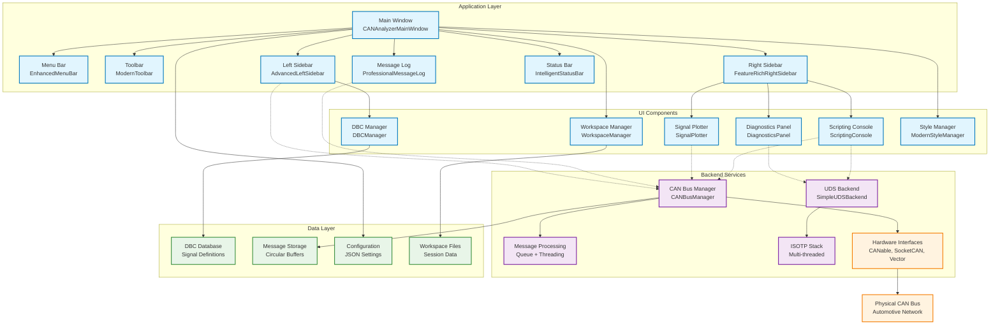
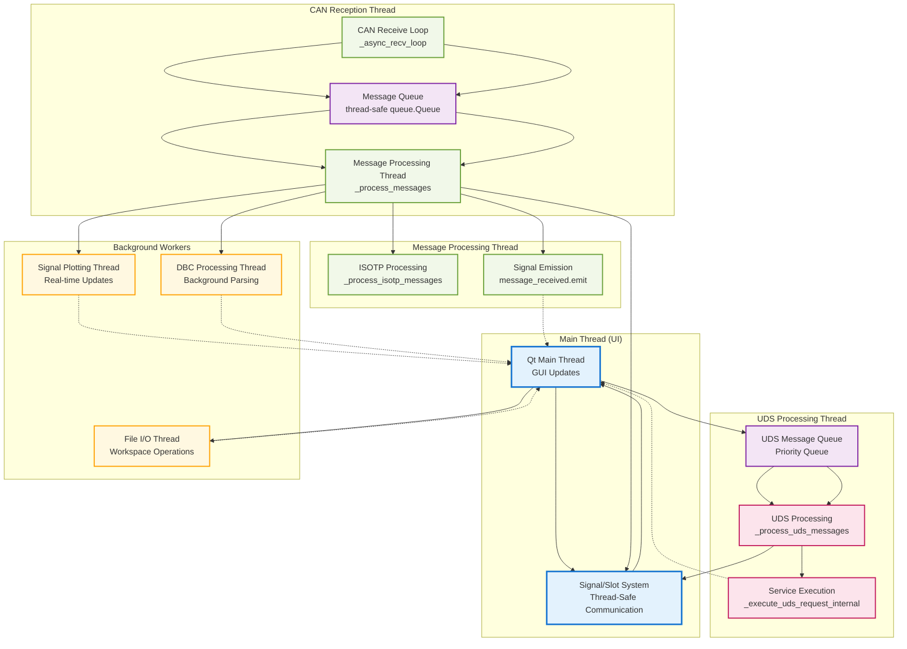
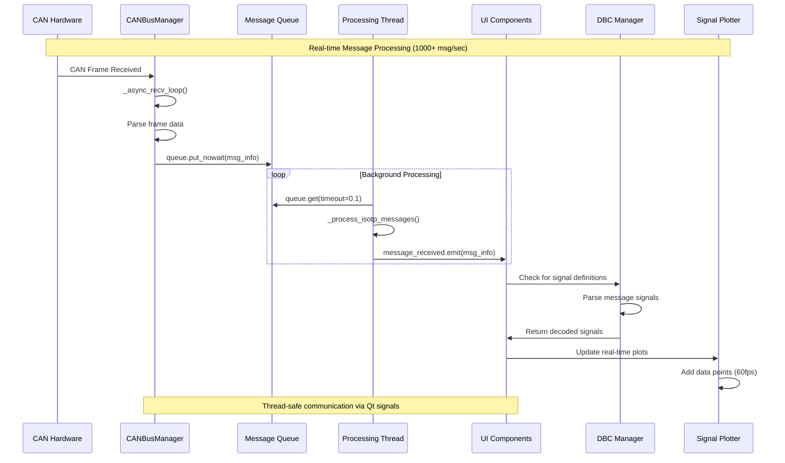
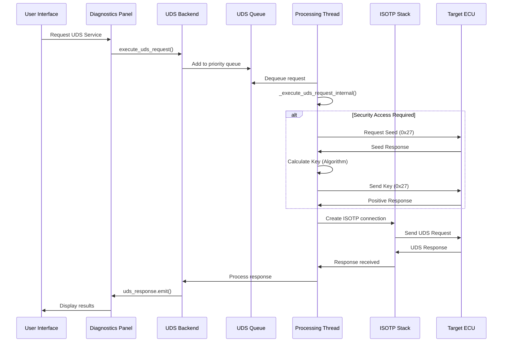
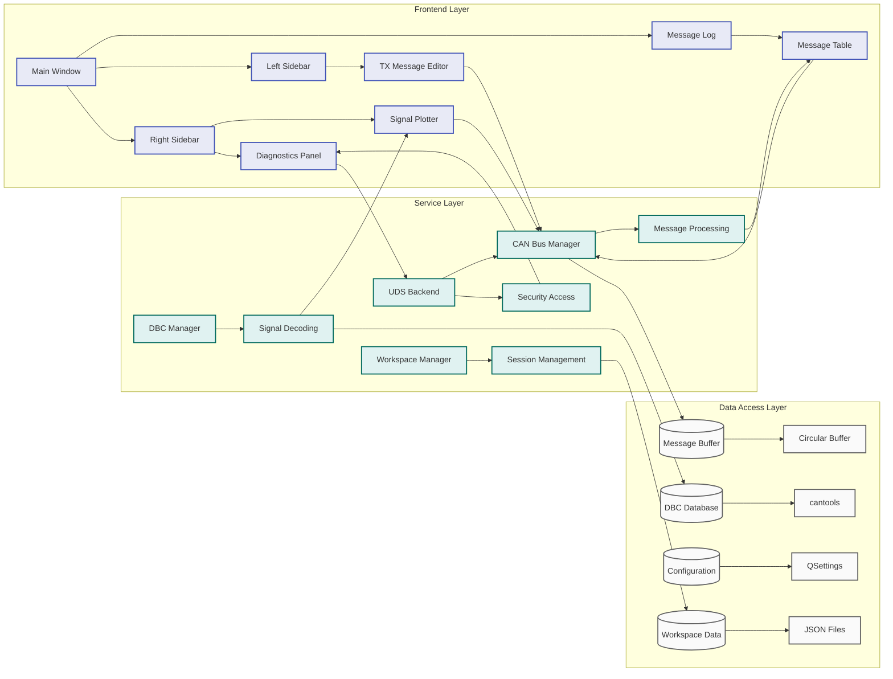
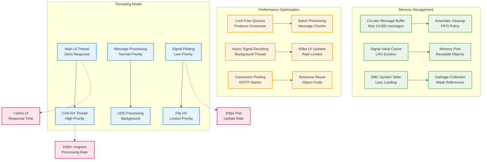
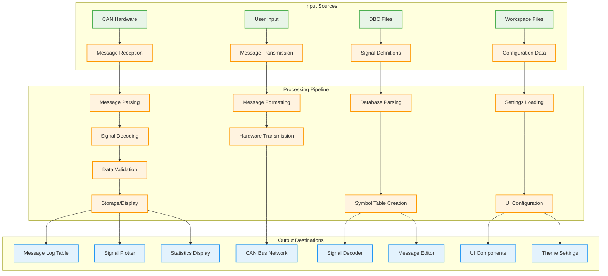

# BrightAnalyze Software Architecture Diagrams

## 1. High-Level System Architecture

## 2. Threading Architecture

## 3. CAN Message Flow Sequence

## 4. UDS Diagnostic Sequence

## 5. Component Interaction Architecture

## 6. Memory Management & Performance Architecture

## 7. Security & UDS Service Architecture

```mermaid
graph TB
    subgraph "UDS Service Layer"
        A[Session Control 0x10] --> B[Default Session]
        A --> C[Programming Session]
        A --> D[Extended Session]
        
        E[Security Access 0x27] --> F[Seed Request]
        E --> G[Key Response]
        E --> H[Algorithm Engine]
        
        I[Read Data 0x22] --> J[ECU Information]
        I --> K[Live Data Values]
        
        L[Write Data 0x2E] --> M[Configuration Data]
        L --> N[Calibration Values]
        
        O[Routine Control 0x31] --> P[Start Routine]
        O --> Q[Stop Routine]
        O --> R[Request Results]
    end
    
    subgraph "Security Algorithms"
        H --> S[XOR Algorithm]
        H --> T[Addition Algorithm]
        H --> U[CRC16 Algorithm]
        H --> V[Custom DLL Integration]
    end
    
    subgraph "ISOTP Layer"
        W[Single Frame SF] --> X[≤7 bytes]
        Y[First Frame FF] --> Z[>7 bytes start]
        AA[Consecutive Frame CF] --> BB[Continuation data]
        CC[Flow Control FC] --> DD[Buffer management]
    end
    
    subgraph "Error Handling"
        EE[Negative Response 0x7F] --> FF[Service Not Supported]
        EE --> GG[Conditions Not Correct]
        EE --> HH[Request Out of Range]
        EE --> II[Security Access Denied]
    end
    
    %% Service Flow
    A --> E
    E --> I
    E --> L
    E --> O
    
    %% ISOTP Integration
    A -.-> W
    I -.-> Y
    L -.-> Y
    O -.-> Y
    
    %% Error Paths
    E --> EE
    I --> EE
    L --> EE
    O --> EE
    
    classDef service fill:#e1f5fe,stroke:#0277bd,stroke-width:2px
    classDef security fill:#fff3e0,stroke:#f57c00,stroke-width:2px
    classDef isotp fill:#f3e5f5,stroke:#7b1fa2,stroke-width:2px
    classDef error fill:#ffebee,stroke:#c62828,stroke-width:2px
    
    class A,B,C,D,I,J,K,L,M,N,O,P,Q,R service
    class E,F,G,H,S,T,U,V security
    class W,X,Y,Z,AA,BB,CC,DD isotp
    class EE,FF,GG,HH,II error
```

## 8. Data Flow Architecture

These diagrams provide a comprehensive view of BrightAnalyze's software architecture, showing:

1. **High-level component organization** and relationships
2. **Threading architecture** with performance optimizations
3. **Message processing flow** with real-time capabilities
4. **UDS diagnostic sequences** with security access
5. **Component interactions** across layers
6. **Memory management** and performance features
7. **Security and UDS service** implementation
8. **Data flow** from input to output

The architecture demonstrates the sophisticated threading model that enables 1000+ messages/second processing while maintaining responsive UI performance.
